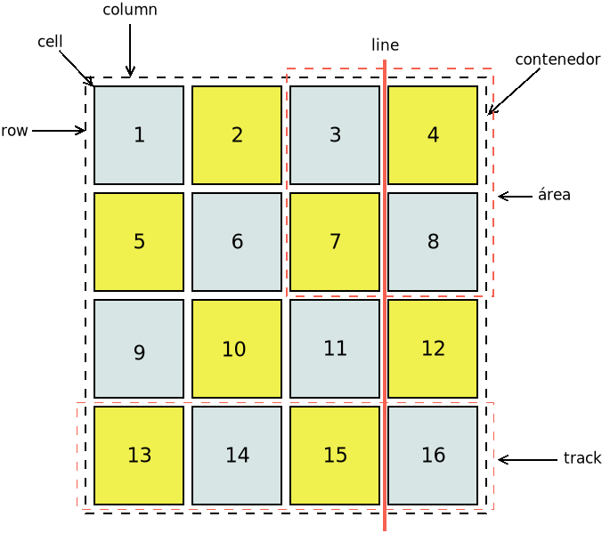

Propiedades
***********
|CSS|\ 3 es una especificación inmensa con `múltiples módulos definidos en
distintos documentos <https://www.w3.org/Style/CSS/current-work>`_ y no tenemos
el tiempo ni la fuerzas para desarrollar en esta documentación un resumen
apropiado. Lo cierto es que para un desarrollador que no sea diseñador es más
práctico utilizar un *framework* como :ref:`Bootstrap`, ya que:

#. Dota de un aspecto atractivo predeterminado a los distintos elementos de la
   página.
#. Tiene ya definidos componentes habituales lo que nos ahorra tener que
   crearlos.
#. Como consecuencia de los dos puntos anteriores, la labor del desarrollador se
   limita a personalizar mínimamente el aspecto con |CSS|.

El epígrafe, por tanto, se limitará a dar un conjunto de pautas para entender y
aprender las propiedades |CSS| y expondrá brevemente los principios de
maquetación con las dos estrategias más modernas y potentes: :ref:`css-flexbox`
y :ref:`css-grid`.

Pautas
======
Para su compresión necesitamos conocer:

#. Los fundamentos de su :ref:`sintaxis <css-sintaxis>`: cómo se escriben las
   reglas, cómo se construyen los :ref:`selectores <css-selectores>` y cómo actúa
   el :ref:`algoritmo de cascada <css-cascada>`.

#. Cómo funciona el :ref:`modelo de cajas <html-maquetacion>` y sus dimensiones
   asociadas. Una buen punto de partida es `esta introducción al modelo de cajas
   de lenguajecss.com <https://lenguajecss.com/css/modelo-de-cajas/que-es/>`_.

   .. _css-posicionamiento:

#. Los métodos para colocar (**posicionamiento**) los elementos en el documento.
   Los mecanismos tradicionales eran torpes hasta que apareció
   :ref:`css-flexbox` y, más tarde, :ref:`css-grid`. De nuevo, `la introducción
   a la maquetación de lenguajecss.com
   <https://lenguajecss.com/css/maquetacion-y-colocacion/propiedad-display/>`_
   es un buen comienzo.

   Estos dos mecanismos modernos, junto a :ref:`@media <css-@media>`, son las
   herramientas básicas para el `diseño web adaptable
   <https://es.wikipedia.org/wiki/Dise%C3%B1o_web_adaptable>`_\ [#]_. Échele un
   vistazo a `éste sencillo ejemplo <https://output.jsbin.com/qezalur>`_, que
   implementa una típica web con un cuerpo central de tres secciones (menú de
   navegación, texto propiamente dicho y publicidad). En principio, se
   encuentran en tres columnas, pero si prueba a reducir lo suficiente el ancho,
   verá cómo pasan a situarse una sección por debajo de la otra y, además, la
   publicidad pasa a situarse en medio.

   .. note:: :ref:`Bootstrap` es una alternativa sencilla a la maquetación
      mediante estas herramientas nativas y, además, buen ofrece un aspecto
      predeterminado de los elementos y componentes prefabricados con lo que es
      muy intersante si nos queremos centrar en el desarrollo y no tanto en el
      diseño.

#. Las principales propiedades que nos sirven para dar aspecto básico  a la
   página relativas a:

   + `Texto y fuentes
     <https://lenguajecss.com/css/fuentes-y-tipografias/elegir-tipografia/>`_.
   + `Colores <https://lenguajecss.com/css/colores/codigos-color/>`_.
   + `Bordes <https://lenguajecss.com/css/modelo-de-cajas/bordes/>`_, `márgenes
     y rellenos
     <https://lenguajecss.com/css/modelo-de-cajas/margenes-y-rellenos/>`_.
   + `Listas <https://lenguajecss.com/css/representacion-datos/listas-css/>`_.
   + `Tablas <https://lenguajecss.com/css/representacion-datos/tablas-css/>`_.

   Estas propiedades necesitaremos conocerlas, aunque nos ayudemos de
   :program:`Bootstrap` para personalizar el aspecto predefinidos de las
   páginas. Otras no serán tan necesarias en ese caso, pero son indispensables,
   si no se usa tal herramienta:

   + `Maquetación
     <https://lenguajecss.com/css/maquetacion-y-colocacion/propiedad-display/>`_
     (:devmozcss:`display`, etc).
   + `Diseño adaptativo
     <https://lenguajecss.com/css/responsive-web-design/que-es/>`_, ya que
     nuestro público objetivo en muchos casos accederá desde dispositivos
     distintos a un ordenador (móviles o *tablets*).

.. seealso:: Para el que prefiera los vídeos hay en Youtube toda una `serie
   sobre CSS de Kiko Palomares <https://kikopalomares.com/cursos/css>`_.

.. _css-maquetacion:

Maquetación
===========
La maquetación tradicional con |CSS| se basaba en :ref:`elementos de bloque
<html-maquetacion>` (que de forma natural tendían a ocupar todo el ancho
disponible y a situarse el siguiente por debajo del anterior), definición de sus
anchos (para que no ocuparan todo), la propiedad :devmozcss:`float` y, en
ocasiones, la propiedad :devmozcss:`position`. Como consecuencia, se tenían que
hacer auténticas recetas esotéricas para lograr hacer maquetaciones
relativamente sencillas\ [#]_, que, además, ni siquiera resultaban adaptables a
distintos dispositivos.

La evolución de |CSS| trajo dos modernos métodos de posicionamiento que han
facilitado enormemente esta tarea. En esta apartado explicaremos los fundamentos
de ambos sin entrar en excesiva profundidad. La idea es conocer sus fundamentos
y afianzarlos con un par de juegos que se enlazarán más adelante.

Antes, sin embargo, dejaremos algo de código |CSS| que nos puede servir, en
ambos casos, para ver mejor la maquetación de los bloques:

.. code-block:: css

   #container {
      border: solid 1px black;
      background-color: #EEE;
   }

   .item {
      border: solid 2px black;
      padding: 1em;
   }
   
   .item:nth-child(3n-2) {
      background-color: #FEE;
   }
   .item:nth-child(3n-1) {
      background-color: #EFE;
   }
   .item:nth-child(3n) {
      background-color: #EEF;
   }

.. note:: Para las capturas ilustrativas se ha usado este :download:`documento
   HTML <files/flexbox.html>`.

.. _css-flexbox:

Flexbox
-------

.. caution:: Las explicaciones son totalmente insuficientes, por lo que lo
   conveniene es profundizar con una `guía sobre flexbox
   <https://lenguajecss.com/css/maquetacion-y-colocacion/flex/>`_ más completa.

* Este método de maquetación se aplica sobre las cajas contenidas dentro de
  una caja contenedora cuya propiedad :devmozcss:`display` tenga el valor de
  ``flex``:

  .. code-block:: css
     :emphasize-lines: 1-3

     #container {
      display: flex;
     }

     /* Aspecto adicional de cada ítem */
     .item {
         margin: .15em;
         /* Añadimos una anchura máxima. Si no la añadiéramos:
            - Cuando los ítem se disponen en filas, el ancho de cada uno
              se ajustará para albergar mejor el contenido.
            - Cuando los ítem se disponen en columnas, cada uno ocupa todo
              el ancho del contenedor.
         */
         max-width: 10em;
     }
      
  .. code-block:: html
     :emphasize-lines: 10,30

     <!DOCTYPE html>
     <html lang="es">
        <meta charset="utf-8">
        <title>Maquetación con flex</title>

        <header role="banner">
           
        </header>

        <main id="container">
           <!-- A lo que haya dentro de aquí se aplicará este mecanismo de maquetación -->
           

              
Caja uno uno

           

           

              
Caja dos

           

           

              
Caja tres

           

           

              
Caja cuatro

           

           

              
Caja cinco

           

           

              
Caja seis

           

        </main>
     </html>

* Las cajas contenidas tenderán a situarse horizontalmente una a continuación de
  la otra:

  .. image:: files/flexbox01.png

  y acomodarán su ancho para que así sea:

  .. image:: files/flexbox02.png

* Sin embargo, puede cambiarse la dirección y que se sitúen verticalmente
  (:devmozcss:`flex-direction`):

  .. code-block:: css
     :emphasize-lines: 3

     #container {
        display: flex;
        flex-direction: column;
     }

  .. image:: files/flexbox03.png

  De hecho, en un dispositivo con la pantalla pequeña convendría utilizar esta
  disposición en vez de la horizontal, así que podríamos usar las :ref:`media
  queries <css-@media>` a tal fin:

  .. code-block::

     #container {
        display:flex;
     }

     @media screen and (width <= 400 px) {
        #container {
           flex-direction: column;
        }
     }

* También se pueden *justificar* los bloques (:devmozcss:`justify-content`):

  .. code-block:: css
     :emphasize-lines: 3

     #container {
      display: flex;
      justify-content: right;
     }

  .. image:: files/flexbox04.png

  o:

  .. code-block:: css
     :emphasize-lines: 3

     #container {
      display: flex;
      justify-content: center;
     }

  .. image:: files/flexbox05.png

* Es posible también alterar el orden de los bloques (:devmozcss:`order`):

  .. code-block:: css
     :emphasize-lines: 3

     #item-1 {
      /* Por defecto, todos los ítem tienen para su orden valor 0 */
      order: 1;
     }

  .. image:: files/flexbox06.png

Hay muchas otras posibilidades que se pueden ensayar jugando los 24 niveles de
`Flexbox Froggy <https://flexboxfroggy.com/>`_.

.. _css-grid:

Grid
----
.. caution:: Como en el caso de :ref:`css-flexbox`, las explicaciones son
   insuficientes y convendría  recurrir a una `guía de grid
   <https://css-tricks.com/snippets/css/complete-guide-grid/#aa-animation>`_ completa.

Es el mecanismo más moderno de maquetación y, en principio, el más sencillo para
realizar maquetaciones complejas. Empezemos por definir algunos términos:

:dfn:`Contenedor`

:dfn:`Column`

:dfn:`Row`

:dfn:`Cell`

:dfn:`Area`

:dfn:`Line`

:dfn:`Track`

* Se aplica sobre las cajas que se encuentran contenidas en un elemento cuya
  propiedad :devmozcss:`display` tenga el valor ``grid``, de modo que las dichas
  cajas se disponen en una rejilla o cuadrícula (de ahí su nombre) para la cual
  debemos indicar cuántas filas y columnas tiene:

  .. code:: css

     #container {
        display: grid;
        grid-template: repeat(4, 25%) / repeat(4, 25%);
        /* Equivale a estas dos propiedades por separado 
        grid-template-rows: repeat(4, 25%);
        grid-template-columns: repeat(4, 25%);
        */
     }

  El ejemplo genera una rejilla de 4x4, en la que todas las cajas (ítems)
  ocupan lo mismo\ [#]_. Además, se ha utilizado ``repeat()`` en vez de
  enumerar uno a uno todos los anchos y altos puesto que son iguales.

  Estas medidas se pueden poner en valores absolutos (p.e. 400px) y, si
  los mezcláramos con valores relativos, sería complicado ocupar todo el
  ancho o el alto disponibles. Por ese emotivo, existe para este diseño la
  unidad ``fr`` que significa *fracción del restante*. Por eso, lo anterior
  habría estado mejor haberlo escrito como:

  .. code:: css

     #container {
        display: grid;
        grid-template: repeat(4, 1fr) / repeat(4, 1fr);
        gap: .15em; /* Espacio entre cajas */
     }

  En que cada ítem ocupa una fracción del restante. Como el restante es todo,
  cada caja ocupará el 25%. Aunque esto no es totalmente cierto, porque hemos
  añadido que queremos que quede un espacio de margen entre las cajas. Ese
  margen es tenido en cuenta en los cálculos del navegador, así que cada caja
  ocupará un pelín menos.

  .. image:: files/grid01.png

* Podemos cambiar de orden alguna de las cajas:

  .. code-block:: css
     :emphasize-lines: 2

     #item-1 {
        order: 1;
        background-color: #FA9;
     }

  .. image:: files/grid02.png

* También podemos jugar con las propiedades :devmozcss:`grid-row-start`,
  :devmozcss:`grid-column-start`, :devmozcss:`grid-row-start`,
  :devmozcss:`grid-column-end`, y las propiedades que las resumen
  :devmozcss:`grid-row`, :devmozcss:`grid-column` y :devmozcss:`grid-area` para
  colocar alguna de las cajas en cualquier posición o para hacer que ocupe
  varias posiciones en vertical u horizontal:

  .. code-block:: css
     :emphasize-lines: 2,3

     #item-1 {
        grid-row-start: 3;
        grid-column-start: 3;
        background-color: #FA9;
     }

  .. image:: files/grid03.png

  O bien, podemos ampliar a seis filas, añadir dos cajas más y hacer que la
  primera y la última ocupen todo el ancho:

  .. code-block:: css
     :emphasize-lines: 2,3

      #container {
         display: grid;
         grid-template: repeat(6, 1fr) / repeat(4, 1fr);
         gap: .15em;
      }

      #item-1, #item-18 {
         grid-column: 1 / -1;
         background-color: #FA9;
      }

  .. image:: files/grid04.png

* Cuando la maquetación es complicada, pueden mapearse las distintas áreas que
  ocupan las cajas con la propiedad :devmozcss:`grid-template-areas` y asociar
  luego cada caja a una de estas áreas. Por ejemplo, para estas áreas:

  .. image:: files/grid-template-areas.png

  Deberíamos crear un |CSS| así:

  .. code-block:: css

     #container {
        display: grid;
        grid-template-areas:
           "a a a b"
           "a a a c"
           "d d e e"
           "d d e e";
     }

     #item-1  { grid-area: a; }

     #item-2  { grid-area: b; }

     #item-3  { grid-area: c; }

     #item-4  { grid-area: d; }

     #item-5  { grid-area: e; }

.. todo:: Explicar `auto-fill y auto-fit
   <https://lenguajecss.com/css/maquetacion-y-colocacion/grid-css/#funci%C3%B3n-minmax>`_.

.. todo:: Explicar `subgrid
   <https://developer.mozilla.org/en-US/docs/Web/CSS/CSS_Grid_Layout/Subgrid>`_.

Para aprender más posibilidades intente completar los 28 niveles de  
`CSS Garden <https://cssgridgarden.com/>`_.

.. rubric:: Notas al pie

.. [#] Que el término no le lleve a confusión. En inglés, existe el concepto de
   :dfn:`responsive web design`, que hace referencia a lo que nosotros tratamos
   aquí: un diseño que se adapta el aspecto al tamaño del dispositivo, mediante
   una solución en el cliente (posicionamiento y *media queries*). En cambio,
   existe otro término denominado :dfn:`adaptative web design` más antiguo en
   que se detectan las características del dispositivo y se envía al servidor
   para que este adapte su respuesta y envío una página u otra. Esta última, por
   tanto, es una solución en el servidor.

.. [#] Véase `este artículo de 2005
   <https://desarrolloweb.com/articulos/2112.php>`_ sobre cómo hacer una página
   con dos columnas.

.. [#] En realidad, el elemento contenedor ocupa todo el ancho del dispositivo.
   En cambio, el alto está indefinido a menos que le demos explícitamente una
   altura (cosa que no hemos hecho).

.. |CSS| replace:: :abbr:`CSS (Cascading Style Sheets)`

