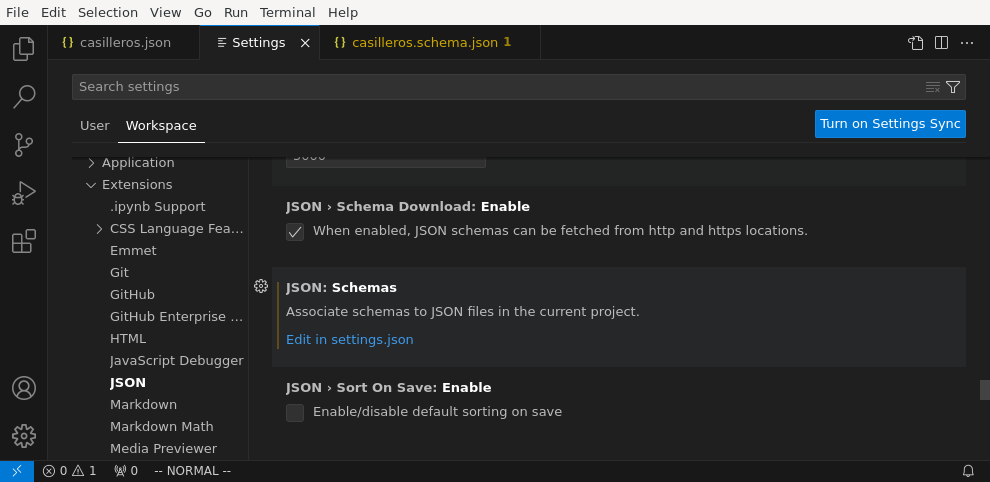

.. _vscode:

Visual Studio Code
******************
Es un editor de texto, con innumerables extensiones, especialmente diseñado para
la escritura de código, y con versiones para los principales sistemas
operativos. Esta disponible para su descarga gratuita en `su página web
<https://code.visualstudio.com/>`_  y su código fuente  está disponible en `su
página de github <https://github.com/microsoft/vscode>`_.

Generalidades
=============
**Idioma**
   Si la instalación trae el programa en inglés, puede instalarse el paquete de
   nuestra lengua pulsando :kbd:`Ctrl`\ +\ :kbd:`Shift`\ +\ :kbd:`P` (o
   seleccionando ``File>Preferences>Settings``) y escribiendo la palabra
   *display* para reducir los términos de búsqueda:

   .. image:: files/00-vscode-lang.png

**Áreas de trabajo**
   La mejor forma de trabajar con el programa es abriendo una *carpeta* en vez de
   archivos individuales, ya que podemos asimilar esta carpetas con proyectos
   (áreas de trabajo) y definir la configuración para cada área de trabajo
   independientemente:

   .. image:: files/01-vscode-abrir.png

**Configuración**
   La configuración puede definirse de forma global o por área de trabajo y
   puede accederse a ella pulsando :kbd:`Ctrl`\ +\ :kbd:`,`:

   .. image:: files/02-vscode-conf.png

   Se almacena en formato |JSON| y, cuando se define para el área de trabajo, se
   almacena dentro de la propia carpeta en :file:`.vscode/settings.json` con que
   es equivalente realizar la configuración a través de la interfaz que
   proporciona :kbd:`Ctrl`\ +\ :kbd:`,`, que editando directamente el archivo.

**Extensiones**
   Las extensiones permiten aumentar las funcionalidades del editor y pueden
   activarse tanto de forma global como por espacio de trabajo. Dependiendo de
   su naturaleza, nos convendrá para algunas lo primero y para otras lo
   segundo.

   Una indispensable para quien se haya criado editando archivos en `vim
   <https://www.vim.org/>`_ es `VSCodeVim
   <https://marketplace.visualstudio.com/items?itemName=vscodevim.vim>`_, que
   permite editar archivos como se hace en el veterano editor.

   Para gestionar las extensiones, basta con pinchar sobre el icono lateral
   izquierdo  señalado:

   .. image:: files/03-vscode-ext.png

.. _vscode-xml:

|XML|
=====
La comprobación de que el documento es bien formado, además de otras
funcionalidades como cerrar automáticamente la etiqueta que se acaba de abrir,
se puede lograr instalando la extensión `XML de RedHat
<https://marketplace.visualstudio.com/items?itemName=redhat.vscode-xml>`_.

Esa misma extensión también permite la validación con |DTD| si se define
correctamente la :ref:`declaración de tipo de documento <dtd-doctype>`. Ahora
bien, por defecto, la extensión no atiende las definiciones hechas en un |DTD|
referido desde otro |DTD| mediante una :ref:`entidad parámetro <dtd-ent-par>`,
lo que malogra una gramática que querramos hacer modular. Puede corregirse
esto haciendo verdadera la opción ``xml.validation.resolveExternalEntities``:

.. code-block:: json

  {
    "xml.validation.resolveExternalEntities": true
  }

Si nuestra intención es evaluar expresiones *XPath* o *XQuery*, tenemos varias
opciones:

* Instalar la extensión `XPath Tester
  <https://marketplace.visualstudio.com/items?itemName=creinbacher.xpathtester>`_,
  que permite evaluar expresiones *XPath* 1.0. Para evaluarlas, basta con pulsar
  :kbd:`Ctrl`\ +\ :kbd:`Shift`\ +\ :kbd:`P` y buscar *XPath* para que accedamos
  al cuadro de diálogo que nos permite hacer evaluaciones.

* Utilizar, en realidad, :ref:`BaseX` a través de :program:`Visual Studio Code`
  para lo cual necesitamos:

  .. rst-class:: simple

  #. Instalar previamente :ref:`BaseX`.

  #. Configurar la extensión `XML Tools
     <https://marketplace.visualstudio.com/items?itemName=DotJoshJohnson.xml>`_
     para que use *BaseX* como procesador. Para ello, necesitamos editar la
     configuración y añadir:

     .. code-block:: json

        {
           "xmlTools.xqueryExecutionEngine": "/usr/bin/basex",
           "xmlTools.xqueryExecutionArguments": [
              "-i", "$(input)",
              "-o", "$(input).output.xml",
              "$(script)"
            ]
        }

     .. caution:: En *Windows* la ruta será algo parecido a
        :file:`c:\\\\\\Program Files
        (x86)\\\\\\BaseX\\\\\\bin\\\\\\\\basex.bat`.  Obsérvese que habrá que
        escapar las contrabarras.

  Una vez bien configurada, el modo de ejecutar la consulta es el siguiente:

  a. Escribimos el archivo :file:`.xq` con el código de *XQuery* y con el
     archivo abierto y seleccionado en el editor.
  #. Pulsamos :kbd:`Ctrl`\ +\ :kbd:`Shift`\ +\ :kbd:`P` y ejecutamos `XML Tools:
     Execute Query`.
  #. Si hay varios |XML| en el directorio se nos preguntará sobre cuál
     queremos hacer la consulta, y, si hemos incluido, la opción :kbd:`-o` en
     la configuración (tal como se ha sugerido antes), se nos pedirá confirmar
     el archivo de salida. Si no la incluimos, la salida se volcará
     directamente en una subventana.
  #. Abrimos el archivo de salida para consultar el resultado.

.. _vscode-json:

|JSON|
======
El editor tiene soporte nativo, por lo que nos señalará sin configuración
adicional si el documento |JSON| que editamos no es bien formado. También es
capaz de validarlo si le proporcionamos el esquema, pero en este caso sí debemos
configurar para relacionar el documento con su gramática. Para ello debemos
abrir la configuración (:kbd:`Ctrl`\ +\ :kbd:`,`) y acceder a
la extensión para |JSON|, una de cuyas configuraciones es ``JSON: Schemas``:

Al pinchar en la edición se nos abrirá el archivo de configuración
:file:`settings.json` que nos permite relacionar archivos |JSON| con los
esquemas que usan. Por ejemplo:

Este es un proyecto abierto como una carpeta en que el esquema está en la
propia carpeta raíz y se ha definido la relación entre archivos |JSON| y
esquemas así:

.. code:: json

   {
       "json.schemas": [
           { "fileMatch": ["casilleros*.json"], "url": "/casilleros.schema.json" }
       ]
   }

La propiedad ``json.schemas`` es una secuencia, cada uno de cuyos elementos
es un objeto que sirve para referir un esquema distinto. En él, ``fileMatch``
es la lista de archivos que siguen el esquema, mientras que ``url`` indica la
|URL| (que no propiamente la ruta) del esquema. Podríamos haber escrito una
|URL| absoluta (con file:`file:///etc.`), pero dado que la |URL| base es la
propia carpeta del proyecto, hemos preferido una |URL| relativa. 

.. _vscode-yaml:

|YAML|
======
A diferencia de lo que ocurre con |JSON|, el soporte para |YAML| no es nativo,
así que es preciso instalar la `extensión para YAML
<https://marketplace.visualstudio.com/items?itemName=redhat.vscode-yaml>`_ para
que el programa comprueba si el documento es bien formado. Si, además, queremos
confrontarlo con un esquema |JSON| para validarlo, entonces requeriremos
configuración adicional que relacione los archivos con su esquema
correspondiente:

.. code:: json

   {
      "yaml.schemas": {
         "./casilleros.schema.json": "casilleros*.yaml"
      }
   } 

En este caso, ``yaml.schemas`` es un objeto y cada objeto tiene como claves
la ruta al esquema (no una |URL| como antes) y como valor el archivo o los
archivos que se rigen por el esquema. Cuando son varios, es necesario usar
una secuencia:

.. code:: json

   {
      "yaml.schemas": {
         "./casilleros.schema.json": ["casilleros*.yaml", "*casilleros.yaml"]
      }
   } 

.. _vscode-html:

|HTML|
======
.. https://code.visualstudio.com/docs/languages/html
   Live Preview
   https://marketplace.visualstudio.com/items?itemName=CelianRiboulet.webvalidator
   https://marketplace.visualstudio.com/items?itemName=smelukov.vscode-csstree : Probar para CSS
   Mirar tareas y asociación de teclas (¿se puede hacer por espacios de trabajo?)
   https://www.mclibre.org/consultar/htmlcss/otros/vsc-htmlcss-configuracion.html

.. |YAML| replace:: :abbr:`YAML (YAML Ain't Markup Language)`
.. |DTD| replace:: :abbr:`DTD (Document Type Definition)`
